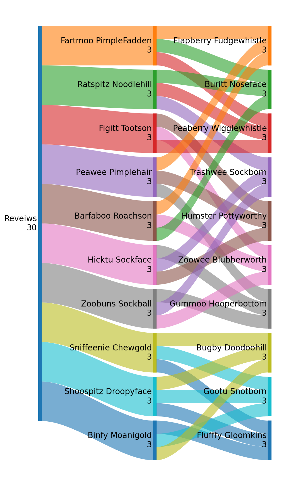

# PyPeerReview-Matching

Python script to facilitate matching reviewers with entrants (i.e., reviewees), using CSV-formatted input files. Both the entrants.csv and reviewers.csv are 4 column files that contain a) the name (first and last), b) their email, c) the methods that they are experts in, and d) their research topics. The reviewers.csv can also have additional columns at the end containing their history of review participation, whose column headers must include the word "Round" for filtering purposes and values as 'yes' or 'no'.

A 2 column, semicolon separated taxonomy.csv file is included for suggestions on values for topics and methods.

The entrants.csv and reviewers.csv can be generated using a spreedsheet program.

Running the notebook will resuting a the creation of matching_results.csv.

   
  Figure 1. An illustration of resulting matching for 10 entrants, each requiring 3 reviews and each reviewer being responsible for performing 3.

#### Known Bug
  Depending on the numbers (i.e., number of reviewers, entrants, and how many reviews should be done), **the script can result in a reviewer obtaining the same entrant twice**. To check this sort the results dataframe by both the reviewers and by the entrants and do a visual inspection. Until this is solved, please check the results and hand edit where needed.

##### Input and Flags:
1) reviewers CSV file (; seperated)
2) entrants CSV file (; seperated)
3) use_history - 'True' or 'False'
4) reviewer_responsibility - number of reviews to be done by each reviewer
5) entrant_needed_reviews - number of reviews need for each entrant

##### Output:
1) CSV formatted file of matchings (; seperated), including itemized and total matching scores.
2) prints to screen the suggested best matchings

##### Library Dependencies:
1) Pandas

##### Structure of input CSV files:
The structure and examples of the entrants.csv nd reviewers.csv input files can be found below.The "Methods" and "Topics" can be several entries that are seperated by a comma. For the reviewers.csv, it is assumed that the last columns are the histories of their participation (i.e., 'yes' or 'no'). These are provided in a column whose header name include the word 'Round' (see example).

##### Contact:
Karl N. Kirschner 
Department of Computer Science 
University of Applied Sciences Bonn-Rhein-Sieg 
Grantham-Allee 20 
53757 Sankt Augustin - Germany 

Email: k.n.kirschner _at_ gmail.com

##### Contribution:
Concept: Kirschner 
Coding and structure:  Jiang, Daniel and Bitterling, Robert (prototype); Kirschner

 

#### entrants.csv example file:
Name;Email;Methods;Topics 
Zoowee Blubberworth;zb@fakemail.com;Mathematics, md;viruses, Security 
Flufffy Gloomkins;fg@fakemail.com;md, Statistics;Virtual Reality, proteins 
etc.

#### reviewers.csv example file:
Name;Email;Methods;Topics;Round 2016;Round  2017;Round  2018;Round  2019 
Peafy Doodoofish;pd@fakemail.com;Numerical Algorithms, Statistical Mechanics, Infrared, Python;Security, Viruses, Virtual Reality, Carbohydrates;No; No; Yes; No 
Peawee Pimplehair;pp@fakemail.com;Numerical Algorithms, Bioinformatics, NMR, Raman;Methods Development, Virtual Reality, DNA, Viruses;Yes; Yes; No; No 
Chewlu Boogerbrain;cb@fakemail.com;Basis Sets, Statistical Mechanics, Molecular Dynamics, Bioinformatics;Security, Virtual Reality, Methods Development, Protein;No; No; No; No 
Eggster HoboSmittens;eh@fakemail.com;Infrared, Machine Learning, NMR, Raman;Security, Carbohydrates, Viruses, DNA;Yes; Yes; Yes; Yes 
etc.

#### matching_results.csv:
Reviewer Name;Entrant Name;Itemized Score [topics, methods, reviewer's history];Total Score 
Fartmoo PimpleFadden;Flapberry Fudgewhistle;['1.000', '1.000', 0];2.0 
Fartmoo PimpleFadden;Buritt Noseface;['0.500', '0.500', 0];1.0 
Fartmoo PimpleFadden;Peaberry Wigglewhistle;['1.000', '0.000', 0];1.0 
Ratspitz Noodlehill;Buritt Noseface;['0.500', '0.500', 0];1.0 
Ratspitz Noodlehill;Peaberry Wigglewhistle;['0.500', '0.500', 0];1.0 
Ratspitz Noodlehill;Trashwee Sockborn;['0.500', '0.500', 0];1.0 
etc.

#### taxonomy.csv:
Topics;Methods 
admet;cg 
aerosols;bioinformatics 
agriculture and food;cheminformatics 
analytical;dft 
atmospheric;docking 
... 
viruses; 
waste and recycling; 
water; 
zwitterions; 

### Sources:
- Fake names obtained from: https://www.imagineforest.com/blog/funny-name-generator/
- The Sankey illustration was made using https://github.com/riley-x/SankeyFlow.git
